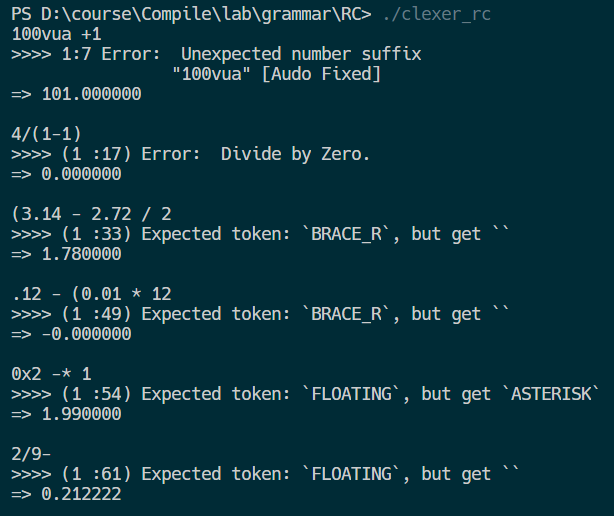

# Yasc
Yet Another Small Compiler.
## 1 任务分析
### 1.1 递归调用
1. 消除左递归：直接和间接
2. 提取左公因子
3. 每个终结符号建立状态转换图
4. 化简状态转换图
5. 构造预测分析程序

### 1.2 LL(1)
1. 自动消除左递归：直接和间接
2. 自动提取左公因子
3. 自动构造FIRST、FOLLOW集
4. 自动构造预测分析表
    - 输入：文法
    - 输出：LL(1)分析表
5. 预测分析程序
    - 输入：符号串（token流）、分析表、分析栈
    - 输出：分析过程采用的产生式序列
6. 鲁棒性：
    - 二义性检查
    - 错误报告与处理

### 1.3 LR(1)
1. 拓广文法
2. 自动构造FIRST集
3. 自动构造识别该文法所有活前缀的DFA
    - 输入：文法
    - 输出：DFA
4. 自动构造该文法的LR(1)分析表
    - 输入：DFA
    - 输出：分析表
6. LR分析程序
    - 输入：符号串（token流）、分析表（action, goto）、分析栈（状态、符号）
    - 输出：分析过程
7. 错误报告与处理

### 1.4 YACC & LEX
YACC 作为语法分析程序生成器，LEX 作为词法分析程序生成器，我们只需要对YACC定义翻译规则，使用LALR(1)文法进行规约，LEX将字符串分析为token流，token流传递到语法分析程序，按照定义的表达式规约，并且输出相应的表达式，其结构如下图所示：


## 2 方法一：递归调用
### 2.1 消除左递归
- 原始：$$
  \begin{array}{l}
  E \rightarrow E+T|E-T| T \\
  T \rightarrow T * F|T / F| F \\
  F \rightarrow(E) \mid \text { num }
  \end{array}
  $$
- 消除左递归后：$$
  \begin{array}{l}
  E \rightarrow TE' \\
  E' \rightarrow +TE'|-TE'|\varepsilon \\
  T \rightarrow FT' \\
  T' \rightarrow *FT'|/FT'|\varepsilon \\
  F \rightarrow(E) \mid \text { num }
  \end{array}
  $$
  
### 2.2 状态转换图及其化简


### 2.3 预测分析程序实现
在第一次实验`词法分析器`（详见附带的第一次实验报告）的基础上添加以下函数即可运行：
```c++=
void procE()
{
    procT();
    if (token == Add)
    {
        match(Add);
        procE();
    }
    else if (token == Sub)
    {
        match(Sub);
        procE();
    }
}

void procT()
{
    procF();
    if (token == Asterisk)
    {
        match(Asterisk);
        procT();
    }
    else if (token == Div)
    {
        match(Div);
        procT();
    }
}

void procF()
{
    if (token == Brace_l)
    {
        match(Brace_l);
        procE();
        match(Brace_r);
    }
    else if (token == Integer)
    {
        match(Integer);
    }
    else if (token == Floating)
    {
        match(Floating);
    }
}
```

### 2.4 语法制导翻译实现计算器
为了验证递归调用的正确性，我们采用语法制导翻译的知识对程序进行改进，实现一个能够进行`整数`和`浮点数`在命令行中四则运算的计算器：

注：原文法运算顺序为左结合，我们再此基础上设置乘除优先级大于加减
#### 代码实现
```cpp=
double procE()
{
    double lvalue = procT();
    return procEend(lvalue);
}

double procEend(double lvalue)
{
    if (token == Add)
    {
        match(Add);
        double value = lvalue + procT();
        return procEend(value);
    }
    else if (token == Sub)
    {
        match(Sub);
        double value = lvalue - procT();
        return procEend(value);
    }
    else
    {
        return lvalue;
    }
}

double procT()
{
    double lvalue = procF();
    return procTend(lvalue);
}

double procTend(double lvalue)
{
    if (token == Asterisk)
    {
        match(Asterisk);
        double value = lvalue * procF();
        return procTend(value);
    }
    else if (token == Div)
    {
        match(Div);
        double value = lvalue / procF();
        return procTend(value);
    }
    else
    {
        return lvalue;
    }
}

double procF()
{
    double value = 0;
    if (token == Brace_l)
    {
        match(Brace_l);
        value = procE();
        match(Brace_r);
    }
    else if (token == Integer)
    {
        value = token_val;
        match(Integer);
    }
    else
    {
        value = token_val_double;
        match(Floating);
    }
    return value;
}
```

#### 运行结果
测试用例：
```cpp
2+3*4                       // 14  （乘除高优先级）
(3.14 - 2.72) / 2           // 0.21 （浮点运算）
3 * ((66 - 99) / 3 + 1)     // -30  （括号改变顺序）
208341/66317                // 3.141593 （double精度）
0x2a / 2 - 030              // -3 （十六进制和八进制数）
1.575E1*((25E-4*40)+1.9)     // 31.5 （浮点数缩略形式）
1.575E1 * ((25E-4 * 40) + 1.9) // 31.5 （自动忽略空格）
```


### 2.5 错误报告与自动纠错
- 数字检查与纠错（在词法部分实现）
- 括号匹配检查与纠错
- 语法报错
主要通过匹配函数实现：
```cpp=
void match(int tk)
{
    if (token == tk)
    {
        next();
    }
    else
    {
        printf("(%3d :%3d)  %-18s=>   ", row_count, column_now,
        token_map[token].first.c_str());
        printf("Expected token: `%s`, but get `%s`\n",
        token_map[tk].first.c_str(), token_map[token].first.c_str());
    }
}
```

#### 运行结果
这里主要展示语法错误：
- 测试用例
```c
100vua +1           // 数字错误（词法错误）
4/(1-1)             // 除0错误（语义错误）
(3.14 - 2.72 / 2    // 括号不匹配（语法错误）
.12 - (0.01 * 12    // 括号不匹配（语法错误）
0x2 -* 1            // （语法错误）
2/9-                // （语法错误）
```



## 3 方法二：LL(1)
### 3.1 原理
本语法分析程序在LL(1)和LR(1)的分析中均利用了上次实验实现的词法分析程序，将输入表达式转化为 Token Stream，然后采用不同的语法分析器对输入的算术表达式进行分析，并且输出分析过程和采用的表达式。流程如下：


JSON格式语法配置文件，支持自由配置语法，在`grmmar.json`文件中修改即可：
```json=
{
    "start": "E",
    "N": ["E", "T", "F"],
    "T": ["+", "-", "*", "/", "(", ")", "num"],
    "productions": {
        "E": ["E+T", "E-T", "T"],
        "T": ["T*F", "T/F", "F"],
        "F": ["n", "(E)"]
    }
}
```
LL(1)分析程序的核心部分是构造预测分析表，再通过预测分析表与分析栈进行控制，实现对输入符号串的自顶向下分析。


### 3.2 数据结构
#### 语法
我们通过`std::pair<char, string>`结构代表一个产生式
```cpp=
struct Grammar {
    char start;                        //开始符号
    set<char> T;                       // 终结符
    set<char> N;                       // 非终结符
    vector<pair<char, string>> prods;  //产生式
};
```

#### FIRST集和FOLLOW集
```cpp=
map<char, set<char>> first;       // first set
map<char, set<char>> follow;      // follow set
```

#### 预测分析表
预测分析表通过`std::map`建立`std::pair<stack_top，input>`与分析动作的`Hash`映射，通过红黑树的数据结构实现`O(log(n))`的高效查询。
```cpp=
map<pair<char, char>, string> M;  // analysis table
```

#### 分析栈
为了便于输出打印的高效性，我们没有采用`std::stack`作为常规的栈数据结构，而是使用了更为灵活的`std::vector`作为栈，更方便进行遍历输出。
```cpp=
vector<char> analysis_stack;      // analysis stack
```

### 3.3 算法实现
略
### 3.4 运行说明
本项目采用`Make`作为构建工具，通过makefile文件告诉make命令需要怎么样的去编译和链接程序。

`Makefile`文件如下：
```makefile=
.PHONY: rc
.PHONY: ll1
.PHONY: lr1

rc: RC		# build & run
	./RC

RC:	Lexer.cpp RC.cpp # build
	g++ Lexer.cpp RC.cpp -o RC

ll1: LL1	# build & run
	./LL1

LL1: LL1.cpp Lexer.cpp	# build
	g++ LL1.cpp Lexer.cpp -o LL1

lr1: LR1	# build & run
	./LR1

LR1: LR1.cpp Lexer.cpp	# build
	g++ LR1.cpp Lexer.cpp -o LR1
```
对于`ll(1)`文法，命令行运行`make LL1`进行编译，运行`make ll1`进行编译和运行：
```bash
$ make ll1
$ make LL1
```

### 3.5 测试情况
#### 测试一：整数 $(1 + 2) * 3 - 4$


#### 测试二：浮点数与多进制 $1.575E1*((25E-4*40)+1.9) + (0x2a / 2 - 030)$


经验证，上述所求的FIRST集、FOLLOW集、预测分析表和输出的产生式均正确，LL(1)语法分析程序工作正常。

#### 测试三：语法错误情况
与递归调用相同，我们同样实现了对于绝大多数词法、语法错误的处理：
- 数字检查与纠错（在词法部分实现）
- 括号匹配检查与纠错
- 语法报错

语法错误示例如下：


## 4 方法三：LR(1)
### 4.1 原理
LR(k)项目：`[A -> α.β, a1a2...ak]`，相比LR(0)项目集，后面多了k个符号，表示能出现在A后面的符号（或A后面的符号串的first集）（是A的follow集的子集）。称a1a2..ak为项目的向前搜索符号串。对于LR(1)有效项目，向前搜索符号串的长度为1。

向前搜索符号仅对规约项目有意义。意为：后续的k个输入符号为a1a2...ak时才允许此规约的发生。

分析原理如下：


与LL(1)相同，可以通过JSON的格式语法配置文件自由配置语法，在`grmmar.json`文件中修改即可。

### 4.2 数据结构
#### 语法
语法的数据结构与LL(1)文法相同：
```cpp=
struct Grammar {
    char start;
    set<char> T;                       // 终结符
    set<char> N;                       // 非终结符
    vector<pair<char, string>> prods;  //产生式
};
```
`FIRST`集与LL(1)相同，也不再赘述。

#### LR(1)项目集规范族
我们采用结构体的方式定义LR(1)项目，并且重载了`<`和`=`符号，用于红黑树比较操作等算法。
```cpp=
struct Item  // LR1 item
{
    pair<char, string> prod;  // production
    int dot;                  // dot position
    char lookahead;           // lookahead string
    bool operator<(const Item& rhs) const {
        if (prod.first < rhs.prod.first)
            return true;
        else if (prod.first > rhs.prod.first)
            return false;
        else if (prod.second < rhs.prod.second)
            return true;
        else if (prod.second > rhs.prod.second)
            return false;
        else if (dot < rhs.dot)
            return true;
        else if (dot > rhs.dot)
            return false;
        else
            return lookahead < rhs.lookahead;
    }
    bool operator==(const Item& rhs) const {
        return prod == rhs.prod && dot == rhs.dot && lookahead == rhs.lookahead;
    }
};
```
LR(1)项目集采用 `std::set<item>`即可表示。

对于LR(1)项目集规范族，采用`std::vector`存储项目集表示，方便存储和遍历；而项目集之间的连线，即自动机状态转移的存储结构采用了`std::vector`存储`std::map`实现，`std::map`中映射了当前输入符号和对应的转移状态：
```cpp=
vector<set<Item>> canonical_collection;  // canonical collection
vector<map<char, int>> dfa;              // dfa
```

#### 分析栈
分析栈在LL(1)基础上进行改动，存储`std::pair<state, symbol>`：
```cpp=
vector<pair<int, char>> analysis_stack;  // analysis stack <state, symbol>
```

#### LR(1)分析表
建立`action`表和`goto`表，均采用与LL(1)中类似的基于红黑树的`std::map`结构，我们为了方便输出才采用该结构，如果为了提高算法效率，可以采用`std::unordered_map`这种基于哈希表的结构以实现`O(1)`的更加快速的查询。
```cpp=
map<pair<int, char>, pair<char, int>> table_action;
map<pair<int, char>, int> table_goto;
```

### 4.3 算法实现
#### 拓广文法
拓广文法只需要进行表达式插入即可：
```cpp=
void Parser::expand_grammar() {
    grammar.prods.insert(grammar.prods.begin(), make_pair('Z', "S"));
}
```

#### 自动构造$FIRST$集
与LL(1)完全相同，这里不再赘述。

对默认文法执行结果如下：


#### $Closure$闭包
#### $go$转移函数
#### 自动构造识别该文法所有活前缀的DFA
对默认语法的执行结果如下（部分截图）：


#### 自动构造该文法的LR(1)分析表
对默认语法自动构造LR(1)分析表如下：

#### LR分析程序


### 4.4 运行说明
本项目采用$Make$作为构建工具，通过makefile文件告诉make命令需要怎么样的去编译和链接程序。

对于$ll(1)$文法，命令行运行`make LR1`进行编译，运行`make lr1`进行编译和运行：
```
$ make LR1
$ make lr1
```

### 4.5 测试情况
#### 测试一：整数 $(1 + 2) * 3 - 4$

可以验证，分析结果正确。

#### 测试二：浮点数与多进制 $1.575E1*((25E-4*40)+1.9) + (0x2a / 2 - 030)$

可以验证，分析结果正确。

#### 测试三：语法错误情况
语法错误能够识别的情况与LL(1)相同，对于不满足LR(1)要求的语法也会进行相应的报错。

错误示例如下：


## 5 方法四：YACC & LEX
### 5.1 原理
在YACC文件中，main函数调用了yyparse()，此函数由YACC替你生成的，在y.tab.c文件中。函数yyparse从yylex中读取符号/值组成的流。可以通过自己编码实现，也可以让Lex自动完成。

- Lex的输入：词法规则（.lex文件）
- Lex的输出：词法分析器
- Yacc的输入：语法规则（.y文件）
- Yacc的输出：语法分析器

### 5.2 算法实现
lex实现如下
```c=
%option noyywrap
%{
#include "y.tab.h"
int num[100];
int yywarp (void);
%}

space		 [' ']*
wrap		 [\n]
letter    	 [A-Za-z]
digit     	 [0-9]
num       	 {digit}+(\.{digit}+)?

%%
{num}          {yylval=atof(yytext);return (NUM);}
{space}		   {printf(" ");}
{wrap}		   {return '\n';}
.			   {return yytext[0];} 
%%

int yywarp (void){
	return 1;
}
```

Yacc 实现如下：
```c=
%{
#include <stdio.h>
#include <stdlib.h>
#include <string.h>

int yylex(void);
void yyerror(char * s);
%}

%token NUM
%right MINUS
%left '+' '-'
%left '*' '/'

%%
lines :
    lines E '\n' {printf(" => %d\n",$2);}
	| lines '\n'
	|		// empty
	| error '\n' {yyerror("Error!"); yyerrok;}
	| '-' E %prec MINUS {$$ = -$2;printf("E->-E\n");}
	;

E :
    E '+' T {$$ = $1 + $3;printf("E->E+T\n");}
	| E '-' T {$$ = $1 - $3;printf("E->E-T\n");}
	| T {printf("E->T\n");}
	;

T :
    T '*' F {$$ = $1 * $3;printf("T->T*F\n");}
	| T '/' F {$$ = $1 / $3;printf("T->T/F\n");}
	| F {printf("T->F\n");}
	;

F : 
    '(' E ')' {$$ = $2;printf("F->(E)\n");}
	| NUM {printf("F->num\n");}
	;
%%

void yyerror(char * s){
	printf("%s\n",s);
}

int main (){
	return yyparse();
}
```
LALR需要的项目集规范族、DFA和分析表有YACC程序生成，再按照分析表进行移进和规约，完成LALR语法分析。

对于二义性的冲突，LALR算法语法分析遇到动作冲突，有规约-规约冲突和移进-规约冲突，对于规约-规约冲突，默认选择第一个冲突进行分析，对于移进-规约冲突，总是进行亦如操作。

我们定义优先级$*$ 和$/$相同， 优先级大于$+$和$-$，通过$left$语句定义左结合和优先级。

### 5.3 编译运行
```bash=
$ yacc calc.y -d
$ lex calc.lex
$ gcc *.c -o calc -ll
```

### 5.4 测试情况
#### 正确算术表达式
```c
2+3*4                       // 14  （乘除高优先级）
(8 - 2) / 2                 // 3 （括号优先级，自动忽略空格）
3 * ((66 - 99) / 3 + 1)     // -30  （括号改变顺序）
208341/66317                // 3 （取整）
```
运行结果：


#### 错误测试
```c
0x2a / 2 - 030              // -3 （二进制和八进制不支持，报错）
1.575E1*((25E-4*40)+1.9)    // 31.5 （浮点数缩略不支持，报错）
(3.14 - 2.72 / 2    // 括号不匹配（语法错误）
0x2 -* 1            // （语法错误）
4/(1-1)             // 除0错误（语义错误）
```

测试结果：


## 6 References
- https://github.com/brupst/awesome-bupt-scs/blob/master/projects/Compilers.md
- http://dinosaur.compilertools.net/
- C99 standard (ISO/IEC 9899:1999)
- c4 - C in four functions
- Aho, Alfred V., Ravi Sethi, and Jeffrey D. Ullman. "Compilers, principles, techniques." Addison wesley 7.8 (1986): 9.


